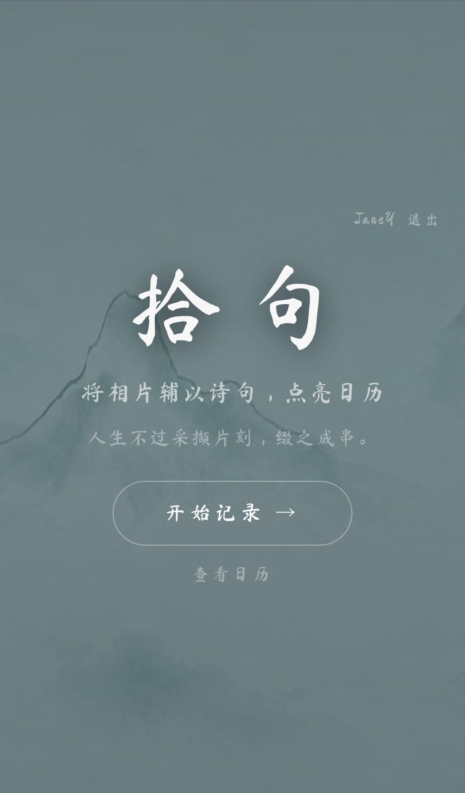
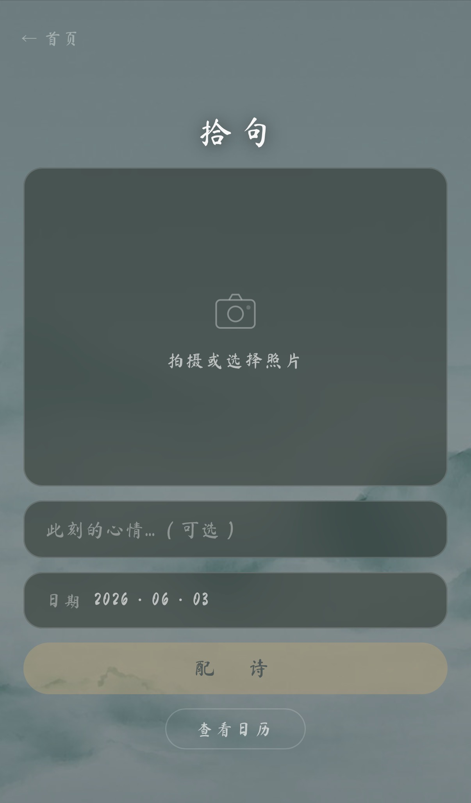
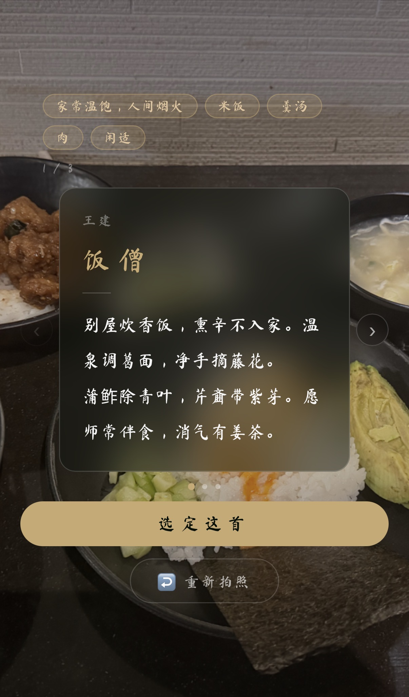
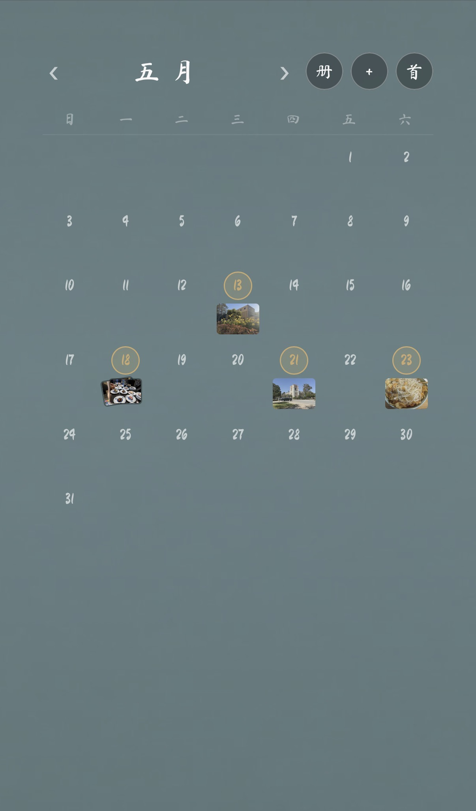
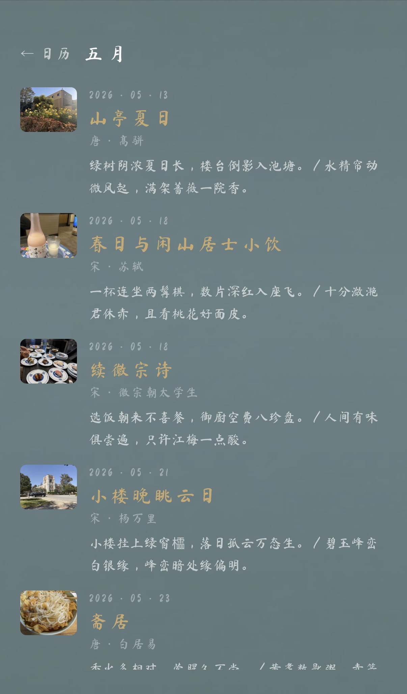

# 拾 句

### 为你眼前的景，配三首恰好的诗

**[→ 立即体验 shiju.app](https://shiju.app)**

**落日余晖的傍晚，是否想吟咏两句却张口忘词；**
**轻寒轻暖的年末，是否想回忆过往却雾里看花？**

**拾句，意为捡起生活中的点滴，缀之成串；**
**见山见水时，替你拾起那句未曾说出口的诗。**

---

## 界面预览

  

  
  
  

  
  

---

## 功能介绍

### 拍照配诗
上传任意一张照片，可选附上当下心情或关键词。AI 同步分析照片意境与用户文字，返回 2–3 首风格、意象最贴合的古诗词，可左右滑动比较，选定后收入日记。

### 语义匹配，而非关键词搜索
底层使用 BGE 中文向量模型对全库诗词编码，搜索时按语义相似度而非字面匹配，能理解「落日余晖」和「夕阳西沉」说的是同一件事。

### 名家权重 + 流传度过滤
李白、杜甫、苏轼等名家诗词获额外加成；无名氏作品须达到更高相似度才能入选，保证推荐结果有品质、有流传度。

### 诗词日历
所有配诗记录按日期存入日历，可月视图浏览，点击任意日期查看当天照片与诗词，支持重新配诗、修改日期、删除。

### 账号与云端同步
注册登录后数据存储在云端，换设备访问记录不丢失。

---

## 技术栈

| 层级 | 技术 |
|---|---|
| 后端 | Python · FastAPI |
| 数据库 | PostgreSQL（Railway 托管，38 万首诗永久存储） |
| 向量检索 | ChromaDB · BAAI/bge-small-zh-v1.5 |
| 视觉理解 | Gemini 2.5 Flash |
| 前端 | HTML · Tailwind CSS · 原生 JS，无构建步骤 |
| 图片存储 | Cloudflare R2 |
| 部署 | Railway |

---

## 语料来源

基于 [chinese-poetry](https://github.com/chinese-poetry/chinese-poetry) 开源数据集，收录唐诗、宋词、宋诗、元曲等共约 38.5 万首。
